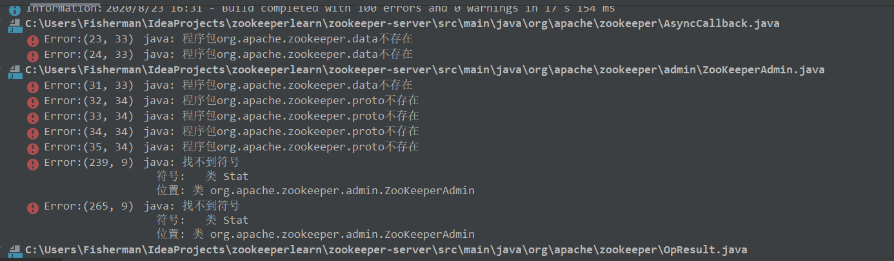
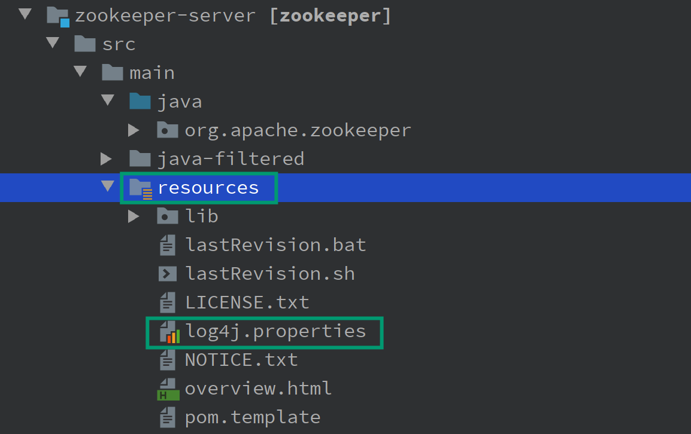
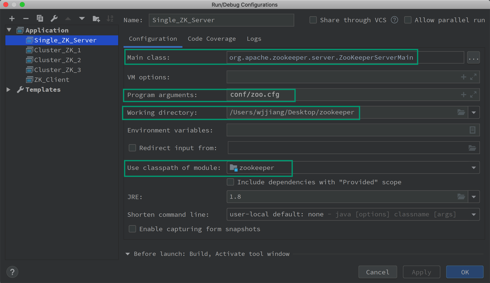
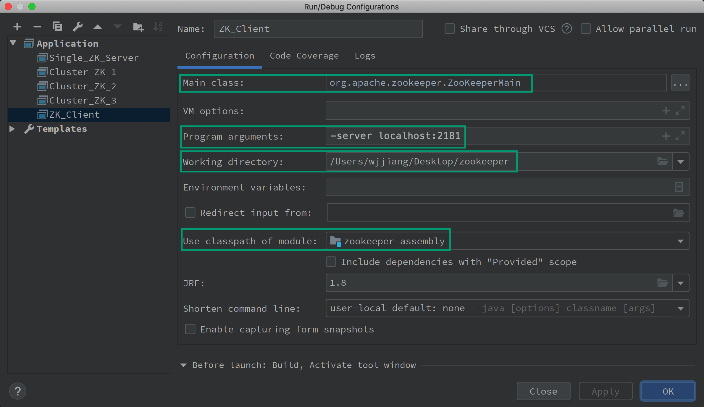
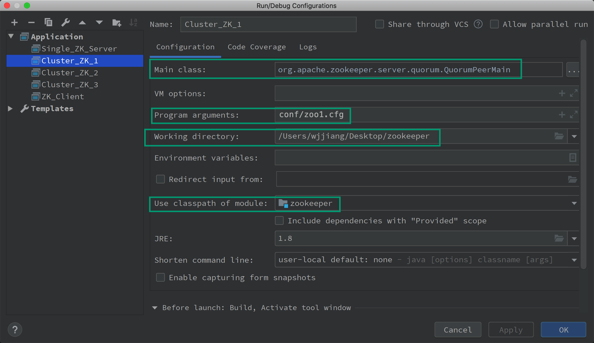

# ZooKeeper 源码分析 [](https://travis-ci.org/apache/zookeeper) [](https://zookeeper.apache.org/releases.html) [](https://github.com/apache/zookeeper/blob/master/LICENSE.txt)


> This Repository is for personal learning and adding comments is the most frequent modifies.
>
> 这个仓库用于个人学习，最常见的修改便是添加相关注释。

## 1. 项目版本说明

本项目基于 ZooKeeper release-3.6.1，使用 release 版本更稳定~

请使用 JDK1.8 u211以及更高版本进行编译。

## 2. 项目依赖管理

在**国内**，IDEA 利用 Maven 解析完毕项目之后，也许会发现大量错误，例如：



> 这张图仅仅截取了部分错误。

首先我们可以将 Version 类写死，因为  org.apache.zookeeper.version.Info 包并不能找到，而这只是用于 zookeeper 用来发布的时候生成版本用的，我们又不发布版本所以直接写死就行了，替换为如下：

```java
public class Version  {

    /*
     * Since the SVN to Git port this field doesn't return the revision anymore
     * TODO: remove this method and associated field declaration in VerGen
     * @see {@link #getHashRevision()}
     * @return the default value -1
     */
    @Deprecated
    public static int getRevision() {
        return -1;
    }

    public static String getRevisionHash() {
        return "1";
    }

    public static String getBuildDate() {
        return "2019-08-11";
    }

    public static String getVersion() {
        return "3.4.14";
    }

    public static String getVersionRevision() {
        return getVersion() + "-" + getRevisionHash();
    }

    public static String getFullVersion() {
        return getVersionRevision() + ", built on " + getBuildDate();
    }

    public static void printUsage() {
        System.out
                .print("Usage:\tjava -cp ... org.apache.zookeeper.Version "
                        + "[--full | --short | --revision],\n\tPrints --full version "
                        + "info if no arg specified.");
        System.exit(1);
    }

    /**
     * Prints the current version, revision and build date to the standard out.
     *
     * @param args
     *            <ul>
     *            <li> --short - prints a short version string "1.2.3"
     *            <li> --revision - prints a short version string with the SVN
     *            repository revision "1.2.3-94"
     *            <li> --full - prints the revision and the build date
     *            </ul>
     */
    public static void main(String[] args) {
        if (args.length > 1) {
            printUsage();
        }
        if (args.length == 0 || (args.length == 1 && args[0].equals("--full"))) {
            System.out.println(getFullVersion());
            System.exit(0);
        }
        if (args[0].equals("--short"))
            System.out.println(getVersion());
        else if (args[0].equals("--revision"))
            System.out.println(getVersionRevision());
        else
            printUsage();
        System.exit(0);
    }
}
```

然后我们删除顶层目录下的 `<scope>` 元素：

```xml
<dependency>
    <groupId>io.dropwizard.metrics</groupId>
    <artifactId>metrics-core</artifactId>
    <version>3.1.0</version>
</dependency>
<dependency>
  <groupId>org.xerial.snappy</groupId>
  <artifactId>snappy-java</artifactId>
  <version>1.1.7.3</version>
</dependency>
<dependency>
  <groupId>org.eclipse.jetty</groupId>
  <artifactId>jetty-server</artifactId>
</dependency>
<dependency>
  <groupId>org.eclipse.jetty</groupId>
  <artifactId>jetty-servlet</artifactId>
</dependency>
```

上面这几个删除掉即可。

然后在 IDEA  的 Maven 插件下输入 `mvn clean install -DskipTests` 命令，这会消耗比较长的时间。

---

如果还可以报错，很有可能是因为 the great wall 的问题，解决方案有：

- 选择阿里云的 Maven 镜像仓库（记得在设置里 Override）；
- 选择机场代理；
- 在 IDEA 的 Maven 配置选项卡中勾选 `Always update snapshots`；

当然网络问题也会导致依赖错误，因此需要再次执行 `mvn clean install -DskipTests` 命令。

## 3. 如何编译运行本项目？

### 3.1 项目克隆

ZooKeeper 较早的版本需要使用 Ant 进行项目管理，不过最近版本的 zookeeper 已经使用了 maven 进行管理了（你可以轻松地在项目顶层路径下发现 pom.xml 文件，而早前版本没有此文件）。

我们可以使用 IDEA 自动导入 Git 项目的方式来引入 ZooKeeper 项目，不过为了更好地做代码管理，我们建议以如下的方式来导入 ZooKeeper 项目：

- 在 https://github.com/apache/zookeeper/ 下选择一个版本，我们这里选择的使 release-3.6.1，然后 fork 到自己的仓库；或者，你可以选择克隆我这个进行了一定的源码注释的 ZooKeeper 版本，地址如下：git@github.com:Spongecaptain/zookeeper.git
- 在 IDEA　编辑器中导入自己仓库的　ZooKeeper 项目，在项目界面选择 `Get From Version Control`

选择克隆项目即可。

接着，让我们等待 IDEA 对项目的解析与同步。

### 3.2 项目配置

当项目通过 IDEA 将项目完全克隆到本地之后，我们可以看到，在 `zookeeper/conf/` 路径下已经有一个 zoo_sample.cfg 文件，我们将此文件复制一份，重命名为 zoo.cfg（实际上如何命名都可以，这是默认配置文件的名称）。

我们需要进行配置的修改，将 dataDir 属性修改为在你机器上，你想存储 ZooKeeper 日志文件与快照文件的路径，我这里选择的配置为：

```properties
# The number of milliseconds of each tick
tickTime=2000
# The number of ticks that the initial 
# synchronization phase can take
initLimit=10
# The number of ticks that can pass between 
# sending a request and getting an acknowledgement
syncLimit=5
# the directory where the snapshot is stored.
# do not use /tmp for storage, /tmp here is just 
# example sakes.
# 类 Unix 系统配置：dataDir=/usr/local/zkData
dataDir=/usr/local/zkData
# Windows 配置：dataDir=E:\\zkData/data1
# dataDir=E:\\zkData/data1
# the port at which the clients will connect
clientPort=2181
admin.serverPort=8888
```

**注意**：

- 类 Unix 系统与 Windows 系统有着不同的路径表示方式（你可以参见上述配置文件中的注释）；
- admin.serverPort 属性设置为 8888 的原因在于我本机的 8080 端口通常用于 Web 开发，我并不想出现冲突；

最后，我们还需要复制一份在 `zookeeper/conf` 目录下天然存在的配置文件 log4j.properties，然后将其复制到 `zookeeper-server/src/main/resources` 路径下。接着，我们选择将此 resources 目录右击，选择 `Mark direct as `，选择 Resources Root。

如下图所示：



这步是必须的，因为我并没有将 resources 路径作为 git 管理的一部分。

> 如果出现 `log4j:WARN No appenders could be found for logger (org.apache.zookeeper.server.quorum.QuorumPeerConfig).` 错误，那么最大的可能你在 GIT 项目后没有在 IDEA 中将  `zookeeper-server/src/main/resources` 路径下右击设置为 root-resources 目录。

### 3.3 项目启动配置

> 由于我编辑器只用 IntelliJ IDEA，因此仅仅对在 IntelliJ 上运行 ZooKeeper 进行说明，不过即使你使用其他 IDE，操作也是类似的。

ZooKeeper 有若干个启动类，有：ZooKeeper 服务端(集群与单机)、ZooKeeper 客户端，因此需要我们确定默认的启动类。

**1.单机(standalone)模式下 ZooKeeper 服务端的启动**

在 IDEA 中选择 Run/Debug Configuration 选项卡，选择添加一个 Application，然后做出如下的配置：

- Main class ：org.apache.zookeeper.server.ZooKeeperServerMain

- Program argument：conf/zoo.cfg

  > 如果你的配置文件路径在别处，配置文件名称不为 coo.cfg，那么请进行一定的修改。

- Working directory：/Users/wjjiang/Desktop/zookeeper

  > 这个选项一般默认就有，无需修改，选择项目的根路径即可。总之不要拷贝我的路径，因为在你的电脑上不存在。

- Use classpath of model：选择 zookeeper

整个配置如下图所示：



> 事实上，将 Main class 选项改为 org.apache.zookeeper.server.quorum.QuorumPeerMain 也是可以启动单机模型下的 ZooKeeper 服务端，只要配置文件属于单机模式即可。

最后，在 IDEA 上选择 Run selected configuration 选项卡即可。

**2.ZooKeeper 客户端启动**

ZooKeeper 客户端启动的配置更简单，其不需要任何配置文件。在 IDEA 中选择 Run/Debug Configuration 选项卡，选择添加一个 Application，然后做出如下的配置：

- Main class ：org.apache.zookeeper.ZooKeeperMain

- Program arguments：-server localhost:2181

- Working directory：/Users/wjjiang/Desktop/zookeeper

  > 通常不需要修改，若修改，请修改为你本机的目录。

- Use classpath of model：选择 zookeeper-assembly

如下图所示：



## 4. （伪）集群模式的启动配置

集群模式下客户端启动配置完全不需要修改，而服务端的启动配置需要进行修改。最小规模的 ZooKeeper 集群应当是 3 个，因此我们需要准备 3 个配置文件，这里还是将它们存放于 `zookeeper/conf/` 路径下。

zoo1.cfg

```properties
tickTime=200000
initLimit=10
syncLimit=5
maxClientCnxns=2
# Mac 的目录配置
dataDir=/usr/local/zkclusterdata/1
# Win 的目录配置
# dataDir=E:\\resources\\Zookeeper\\zookeeper-3.4.11\\conf\\data\\1
clientPort=2181
server.1=127.0.0.1:2887:3887
server.2=127.0.0.1:2888:3888
server.3=127.0.0.1:2889:3889
```

zoo2.cfg

```properties
tickTime=200000
initLimit=10
syncLimit=5
maxClientCnxns=2
# Mac 的目录配置
dataDir=/usr/local/zkclusterdata/2
# Win 的目录配置
# dataDir=E:\\resources\\Zookeeper\\zookeeper-3.4.11\\conf\\data\\1
clientPort=2182
server.1=127.0.0.1:2887:3887
server.2=127.0.0.1:2888:3888
server.3=127.0.0.1:2889:3889
```

zoo3.cfg

```properties
tickTime=200000
initLimit=10
syncLimit=5
maxClientCnxns=2
# Mac 的目录配置
dataDir=/usr/local/zkclusterdata/3
# Win 的目录配置
# dataDir=E:\\resources\\Zookeeper\\zookeeper-3.4.11\\conf\\data\\1
clientPort=2183
server.1=127.0.0.1:2887:3887
server.2=127.0.0.1:2888:3888
server.3=127.0.0.1:2889:3889
```

每一个配置文件在两点上不同，其余配置实际上都是相同的：

- dataDir 不同伪节点的日志文件与快照文件的存放地址；
- clientPort 不同伪节点对客户端连接的监听端口；

我们需要一次在 zoo1.cfg 的 dataDir 指向的路径下创建 myid 文件，属性为 1，zoo2.cfg 与 zoo3.cfg 处理方式同理，下面是一个例子：

```bash
echo '1'  >  /usr/local/zkclusterdata/1/myid
```

**注意事项**：这里的目录修改为你的 dataDir 配置，不同的 cfg 文件路径有所区别。 

事实上，只有伪集群需要如此这般负责配置，如果节点是真的在不同物理主机上存储（或者依赖于 Docket 等工具进行了隔离），那么配置完全可以相同（除了 myid 文件不同）。

接着我们需要为每一个主机节点在 Run/Debug Configuration 选项卡中进行配置，我们还是以节点 1 为例，配置如下：

- Main class ：org.apache.zookeeper.server.quorum.QuorumPeerMain

- Program argument：conf/zoo1.cfg

  > 如果是节点 2，那么就配置为 conf/zoo2.cfg，一次类推。

- Working directory：/Users/wjjiang/Desktop/zookeeper

  > 默认即可。

- Use classpath of model：选择 zookeeper

如下图所示：



其他两个节点除了在 Program arguments 上不同之外，其余配置都相同。

**补充**：在集群模式下，客户端应当知道所有 ZooKeeper 服务器节点的地址，因此我们在单机模式下 ZooKeeper 客户端启动配置的基础上，仅仅修改 Program arguments 选项为：`-server localhost:2181,localhost:2182,localhost:2183`

## 5. 如何阅读 ZooKeeper 源码？

从 ZooKeeperMain（客户端）、QuorumPeerMain（集群模式服务端）、ZooKeeperServerMain（单机模式服务端）作为入手来学习 ZooKeeper 源码是一个不错的选择。

你可以参考我个人博客上 tag 为 ZooKeeper 的相关源码分析博客：

https://spongecaptain.cool/tags/zookeeper/

---

最后，欢迎 star！

Enjoy the Source Code !

