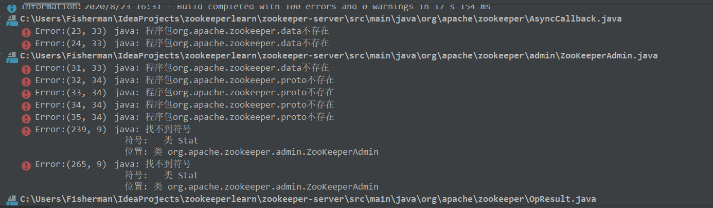
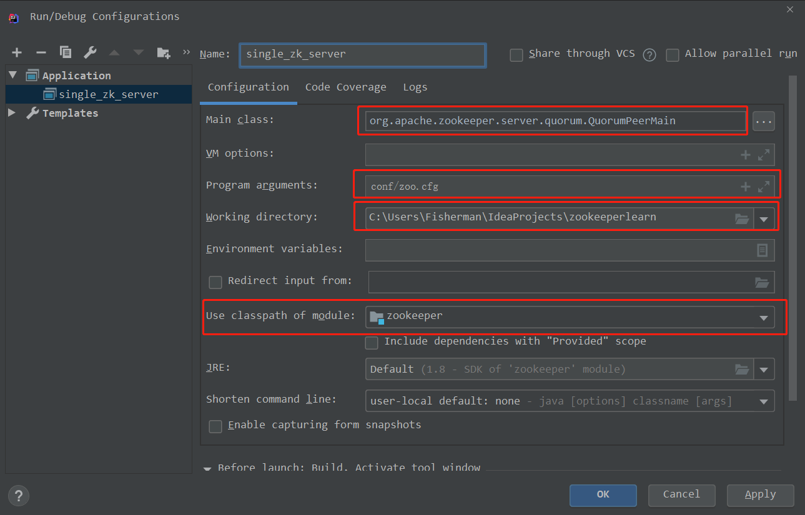
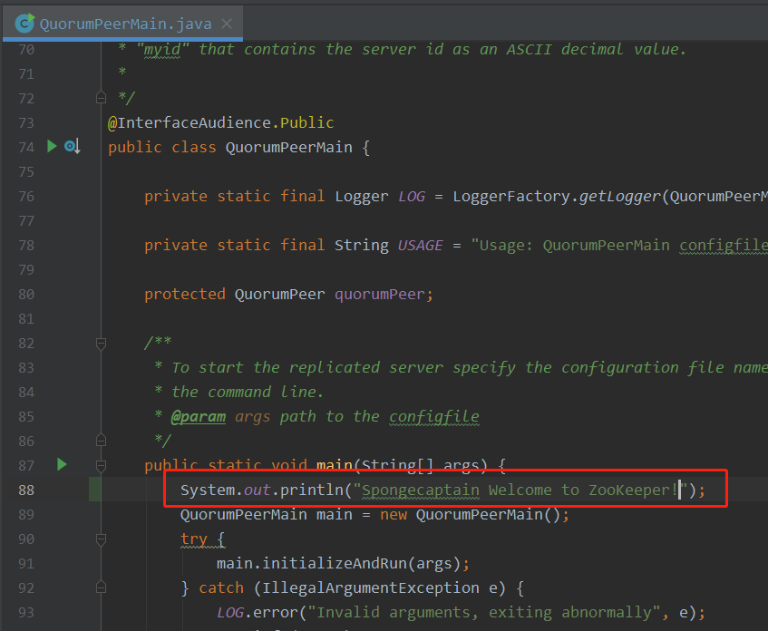

# ZooKeeper 下载与编译

## 1. 下载项目

最近版本的 zookeeper 已经使用了 maven 进行管理了、不再需要安装 `Ant`（你可以轻松地在项目顶层路径下发现 pom.xml 文件，而早前版本没有此文件）。

我们可以使用 IDEA 自动导入 Git 项目的方式来引入 ZooKeeper 项目，不过为了更好地做代码管理，我们建议以如下的方式来导入 ZooKeeper 项目：

- 在 https://github.com/apache/zookeeper/ 下选择一个版本，我们这里选择的使 3.5.8，然后 fork 到自己的仓库（为了稳定起见，我没有使用最新版本 3.6）；
- 在 IDEA　编辑器中导入自己仓库的　ZooKeeper 项目，在项目界面选择 `Get From Version Control`；

选择克隆项目即可。

接着，让我们等待 IDEA 对项目的解析与同步。

## 2. 配置项目

我们可以发现，在 ZooKeeper 项目的路径下已经有一个 zoo_sample.cfg 文件，我们将此文件复制一份，重命名为 zoo.cfg。然后进行修改配置，dataDir 修改为本地你想存储 ZooKeeper 路径，我这里选择的配置为：

```
dataDir=E:\\zkData/data1
```

> 如果是类 Unix 系统，路径配置需要做出一定的修改。

这个文件需要我们提前在相应路径下创建好。

然后我们复制一份在 conf 目录下默认就存在的配置文件 log4j.properties，然后将其复制到 `zookeeper-server/src/main/resources` 路径下。接着，我们选择将此 resources 目录右击，选择 `Mark direct as `，选择 Resources Root。

## 3. IDEA 的启动项配置

ZooKeeper 有若干个启动类，有：ZooKeeper 服务端、ZooKeeper 客户端，因此需要我们确定默认的启动类。

在 Run/Debug Configuration 配置下，做出如下的配置：

- Main class：org.apache.zookeeper.server.quorum.QuorumPeerMain

- Program argument：conf/zoo.cfg

- Working directory：C:\Users\Fisherman\IdeaProjects\zookeeperlearn

  > 这个选项一般默认就有，无需修改，选择项目的根路径即可。

- Use classpath of model：选择 zookeeper

## 4. 爆红处理

> 如果你没有代码爆红问题，那么可以直接选择运行项目。

在 IDEA 利用 Maven 解析完毕项目之后，可以发现大量错误，例如：



首先我们可以将 Version 类写死，因为  org.apache.zookeeper.version.Info 包并不能找到，而这只是用于 zookeeper 用来发布的时候生成版本用的，我们又不发布版本所以直接写死就行了，替换为如下：

```java
public class Version  {

    /*
     * Since the SVN to Git port this field doesn't return the revision anymore
     * TODO: remove this method and associated field declaration in VerGen
     * @see {@link #getHashRevision()}
     * @return the default value -1
     */
    @Deprecated
    public static int getRevision() {
        return -1;
    }

    public static String getRevisionHash() {
        return "1";
    }

    public static String getBuildDate() {
        return "2019-08-11";
    }

    public static String getVersion() {
        return "3.4.14";
    }

    public static String getVersionRevision() {
        return getVersion() + "-" + getRevisionHash();
    }

    public static String getFullVersion() {
        return getVersionRevision() + ", built on " + getBuildDate();
    }

    public static void printUsage() {
        System.out
                .print("Usage:\tjava -cp ... org.apache.zookeeper.Version "
                        + "[--full | --short | --revision],\n\tPrints --full version "
                        + "info if no arg specified.");
        System.exit(1);
    }

    /**
     * Prints the current version, revision and build date to the standard out.
     *
     * @param args
     *            <ul>
     *            <li> --short - prints a short version string "1.2.3"
     *            <li> --revision - prints a short version string with the SVN
     *            repository revision "1.2.3-94"
     *            <li> --full - prints the revision and the build date
     *            </ul>
     */
    public static void main(String[] args) {
        if (args.length > 1) {
            printUsage();
        }
        if (args.length == 0 || (args.length == 1 && args[0].equals("--full"))) {
            System.out.println(getFullVersion());
            System.exit(0);
        }
        if (args[0].equals("--short"))
            System.out.println(getVersion());
        else if (args[0].equals("--revision"))
            System.out.println(getVersionRevision());
        else
            printUsage();
        System.exit(0);
    }
}
```

然后我们删除顶层目录下的 `<scope>` 元素：

```xml
<dependency>
    <groupId>io.dropwizard.metrics</groupId>
    <artifactId>metrics-core</artifactId>
    <version>3.1.0</version>
</dependency>
<dependency>
  <groupId>org.xerial.snappy</groupId>
  <artifactId>snappy-java</artifactId>
  <version>1.1.7.3</version>
</dependency>
<dependency>
  <groupId>org.eclipse.jetty</groupId>
  <artifactId>jetty-server</artifactId>
</dependency>
<dependency>
  <groupId>org.eclipse.jetty</groupId>
  <artifactId>jetty-servlet</artifactId>
</dependency>
```

上面这几个删除掉即可。

然后在 IDEA  的 Maven 插件下输入 `mvn clean install -DskipTests` 命令，这会消耗比较长的时间。

> 后来发现，这些飘红产生的原因可能来源于没有开代理，相关依赖没有正确下载，这里有三个选择可能可以避免这个问题：
>
> - 选择阿里云的 Maven 镜像仓库（记得在设置里 Override）；
> - 选择机场代理；
> - 选择执行 `mvn clean install -DskipTests` 命令；

## 5. 启动

如果单机模式下的 ZooKeeper 服务端，那么如下图配置直接使用 IDEA 的 Run 命令即可运行：



接着就启动成功了。

为了显式源码的优势，我们还能修改 `org.apache.zookeeper.server.quorum.QuorumPeerMain` 类的 main 方法，来进行一些个性化的修改。



> 接着控制台在 ZooKeeper 启动的第一句就会打印出：Spongecaptain Welcome to ZooKeeper!

